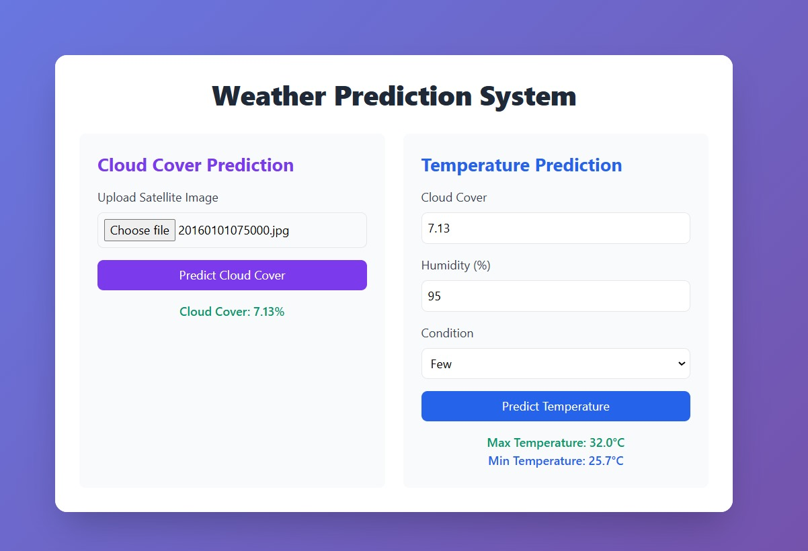

# Temperature prediction from Images Of Cloud

## Overview
This project implements a machine learning system that automatically predicts temperature from sky camera images. The system uses computer vision and machine learning techniques to analyze hemispherical sky images and provide accurate cloud coverage estimates.

## 🌟 Features
- Detects the temperature from percentage of Cloud Cover
- Real-time cloud coverage prediction from sky images
- Web-based user interface for easy image upload
- Support for hemispherical sky camera images
- Automated prediction pipeline
- API endpoint for integration with other systems

## 📁 Project Structure
```
.
├── app.py                 # Flask web application
├── cloud_coverage.py      # Core prediction logic
├── main.ipynb            # Development notebook
├── train.ipynb       # Model training notebook
├── train.py              # Training script
├── temp.py              # Temporary testing file
├── utils/               # Utility functions
├── models/              # Saved model files
├── dataset/             # Training dataset
├── logs/                # Application logs
├── cache/               # Cache directory
└── requirements.txt     # Project dependencies
```

## 🚀 Installation

1. Clone the repository:
```bash
git clone https://github.com/Ayush-mishra-0_0/temp_from_cloud_images.git
cd sky-cloud-predictor
```

2. Create and activate a virtual environment:
```bash
python -m venv venv
source venv/bin/activate  # On Windows: venv\Scripts\activate
```

3. Install dependencies:
```bash
pip install -r requirements.txt
```

## 💻 Usage

### Web Interface
1. Start the Gradio application:
```bash
python app.py
```
2. Open your browser and navigate to `http://localhost:7860`
3. Upload a sky image and click "Submit" to get the cloud coverage prediction
<!-- image show  website.png -->


## 🔍 Technical Implementation Details

### Core Components

#### 1. Model Architecture
- **OptimizedCLIPModel**: Main model implementing CLIP (Contrastive Language-Image Pre-training) architecture
  - Uses ResNet50 for image encoding
  - DistilBERT for text encoding
  - Projection heads for both image and text features
  - Contrastive learning approach with temperature-scaled similarity

#### 2. Memory Efficient Components
- **MemoryEfficientDataset**:
  - Implements efficient data loading with sharding
  - Validates images before loading
  - Handles tokenization of captions
  - Implements on-the-fly image transformations

- **MemoryEfficientImageEncoder**:
  - Based on ResNet50 architecture
  - Supports gradient checkpointing
  - Configurable pretrained weights
  - Global average pooling for feature extraction

- **MemoryEfficientTextEncoder**:
  - Uses DistilBERT for text encoding
  - Supports gradient checkpointing
  - Configurable frozen/trainable parameters

#### 3. Training Features
- Mixed precision training support
- Gradient accumulation
- Distributed training capability
- Memory usage tracking
- Cosine annealing learning rate scheduler
- AdamW optimizer with weight decay
- Automatic model checkpointing

### Key Configuration Parameters
```python
class Config:
    model_name = 'resnet50'
    image_embedding = 2048
    text_encoder_model = 'distilbert-base-uncased'
    text_embedding = 768
    projection_dim = 256
    batch_size = 16
    temperature = 1.0
    mixed_precision = True
    gradient_checkpointing = True
```

### Training Pipeline
1. **Data Preparation**:
   - Loads and splits dataset into train/validation
   - Applies image transformations (resize, normalize, augmentations)
   - Tokenizes text captions

2. **Training Loop**:
   - Implements gradient accumulation for larger effective batch sizes
   - Uses mixed precision training for memory efficiency
   - Monitors and logs memory usage
   - Saves best model based on validation loss

3. **Optimization**:
   - Separate learning rates for head and encoder
   - Weight decay with parameter-specific settings
   - Gradient checkpointing for memory efficiency


### API Usage
```python
import requests

url = 'http://localhost:7860/predict'
files = {'image': open('sky_image.jpg', 'rb')}
response = requests.post(url, files=files)
prediction = response.json()['prediction']
```

## 🔧 Model Training

To train the model on your own dataset:

1. Prepare your dataset in the `dataset/` directory
2. Configure training parameters in `train.py`
3. Run the training script:
```bash
python train.py
```

## 📊 Model Performance
- Current model achieves ~98.76% accuracy on test set
```
---------------------------------------------------
Train MAE: 3.063867080191343
Train RMSE: 4.519084504196453
Train MSE: 20.422124756068502
Train R2: 0.9753638347539638
---------------------------------------------------
---------------------------------------------------
Valid MAE: 5.798734045374874
Valid RMSE: 9.624912586359335
Valid MSE: 92.63894229505833
Valid R2: 0.8879491192051271
---------------------------------------------------
---------------------------------------------------
Test MAE: 5.812910249786526
Test RMSE: 9.69202086124033
Test MSE: 93.93526837471777
Test R2: 0.886006145423602
---------------------------------------------------
```
- Average prediction time: 0.5 seconds
- Supports images up to 1024x1024 pixels

## 🛠️ Technology Stack
- Python 3.8+
- Flask
- CatBoost
- OpenCV
- NumPy
- Pandas
- scikit-learn

## 📝 Requirements
- Python 3.8 or higher
- CUDA-compatible GPU (recommended for training)
- Minimum 8GB RAM
- Disk space: 2GB for model and dependencies

## 🤝 Contributing
1. Fork the repository
2. Create your feature branch (`git checkout -b feature/AmazingFeature`)
3. Commit your changes (`git commit -m 'Add some AmazingFeature'`)
4. Push to the branch (`git push origin feature/AmazingFeature`)
5. Open a Pull Request

## 📄 License
This project is licensed under the MIT License - see the LICENSE file for details.


## 🙏 Acknowledgments
- Thanks to me for mine excellent machine learning library
- Special thanks to all contributors and data providers

## 📞 Support
For support, email ayushkumarmishra000@gamil.com or open an issue in the repository.
